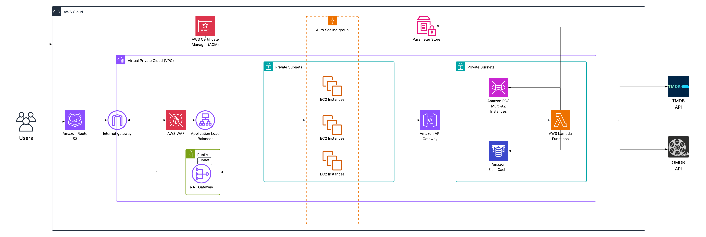

# 🎬 Movie Rating App

## 📷 Architecture Diagram

## 🧩 Key Components

This project showcases a cloud-native deployment of a **scalable movie rating application** using AWS services:

- **AWS VPC** – Virtual private cloud.
- **Amazon Route 53** – DNS resolution and routing.
- **AWS WAF** – Protects against common web exploits.
- **Application Load Balancer** – Distributes incoming traffic across EC2 instances.
- **EC2 Auto Scaling Group** – Scalable frontend running in private subnets.
- **Amazon Cognito** – Handles user authentication and identity management.
- **Amazon API Gateway** – Entry point to backend client.
- **AWS Lambda** – Serverless backend.
- **Amazon RDS (Multi-AZ)** – Highly available relational database.
- **Amazon ElastiCache** – Improves performance with in-memory caching.
- **AWS Systems Manager Parameter Store** – Stores secure configuration and secrets.
- **NAT Gateway** – Allows instances in private subnets to access the internet.
- **External APIs** – Integration with **TMDB** and **OMDB** to fetch movie data.